# Plugin Architecture: Overview

> **Last refreshed:** 2026-05-07. All file paths, line ranges, and counts in this document were verified against the codebase on that date.

## Documents in this set

| File | Purpose |
|---|---|
| **PLUGIN-ARCH_OVERVIEW.md** (this file) | Architecture diagrams, contributor difficulty table, and the before/after end-state. Read this first. |
| **[PLUGIN-ARCH_REFACTOR-PREREQUISITES.md](./PLUGIN-ARCH_REFACTOR-PREREQUISITES.md)** | Bottom-up refactor of god files, DB repositories, stream adapters, and schema normalization. Do this before plugin work. Includes the Documentation Alignment Protocol shared by both plans. |
| **[PLUGIN-ARCH_TASK-LIST.md](./PLUGIN-ARCH_TASK-LIST.md)** | Plugin contract definition, phase-by-phase migration checklist, acceptance criteria. |
**Reading order:** Overview (here) → Prerequisites → Task List. The two plans ship **strictly sequentially**: refactor prerequisites complete first (top to bottom), then plugin migration begins. Some parallelism is technically allowed (Phase A/B against refactor Phases 4–5) but operationally declined — see `PLUGIN-ARCH_TASK-LIST.md` §8 for rationale.

**Documentation alignment:** Both plans follow the **Documentation Alignment Protocol** defined in `PLUGIN-ARCH_REFACTOR-PREREQUISITES.md`. Every `/docs/` page carries an `<!-- ARCH-ALIGNMENT: ... -->` marker that gets bumped when its phase ships. A doc whose marker doesn't match the latest shipped phase covering its subject area is stale.

---

## How to read this document

Each section pairs a **Before** diagram (current state, with the warts visible) and an **After** diagram (post-plan end state). The diagrams are deliberately simplified — they show wiring and ownership, not every function call. If a box is in the "After" diagram but not the "Before," it is new. If a box disappears in "After," it is deleted or absorbed.

Color/shape conventions (used consistently across all diagrams):
- **Rectangles** = code modules / files
- **Cylinders** = persistent state (DB tables, caches)
- **Rounded rectangles** = runtime registries built at boot
- **Dashed arrows** = string-based dispatch (the thing the plan eliminates)
- **Solid arrows** = type-safe / polymorphic calls

---

## 1. Top-level system architecture

### Before

The current `src/index.ts` (17KB, 476 lines) is a monolith that wires every subsystem directly. There are no init modules — `index.ts` itself imports, configures, and starts each piece in order.

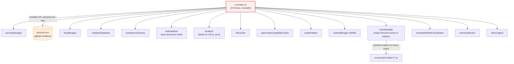

**What's wrong:**
- `index.ts` imports 14+ subsystems directly — adding a new init step means editing this file
- Secrets are pushed into `process.env` as global side effects (lines 83-160 of `index.ts`)
- `eventHandler.ts` uses a hardcoded `eventFolderMap` (lines 23-40) — adding a new Discord event requires editing the map
- Every event fires triggers a fresh `await import()` of every handler file in the folder (the `dbWrite` for #13 in the refactor plan)

### After

`src/index.ts` shrinks to a thin orchestrator. Initialization moves into `src/init/*` modules. A new `src/plugins/pluginLoader.ts` discovers plugin folders and merges their contributions into the existing registries (commands, tools, events, providers, locales, migrations).

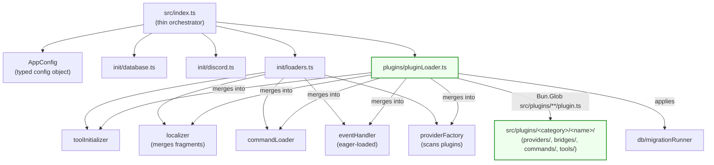

**What changed:**
- `index.ts` no longer touches `process.env` — `AppConfig` is passed explicitly through init modules
- Each `init/*` module is independently testable
- `pluginLoader.ts` is the single new wiring point — it does not replace existing registries, it *contributes to* them
- Adding a new plugin is a folder-drop; adding a new init step is one file under `src/init/`

---

## 2. Provider system

This is the highest-pain subsystem. `providerFactory.ts` already auto-discovers provider classes (it scans `src/providers/*/` for `<name>Provider.ts`), but `providerInfoRegistry.ts` hardcodes the metadata, the feature implementation map, and a string-union type — all of which leak through 79 name-comparison switches across 17 files.

### Before

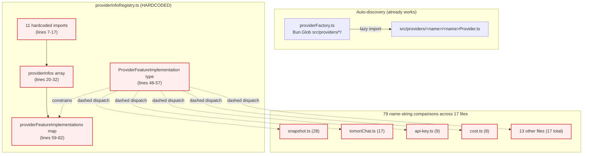

**What's wrong:**
- The `ProviderFeatureImplementation` type union forces every consumer to switch on hardcoded names
- The feature map is a denormalized lookup — each provider's capabilities should be declared *with the provider*, not in a central registry
- Adding a provider requires editing `providerInfoRegistry.ts` *and* potentially every consumer that switches on the name
- `openai/` and `openaiCompatible/` exist as base classes (used via inheritance by `openrouter`, etc.) but have no `providerInfo.ts` — they are already implicitly "shared infrastructure"

### After

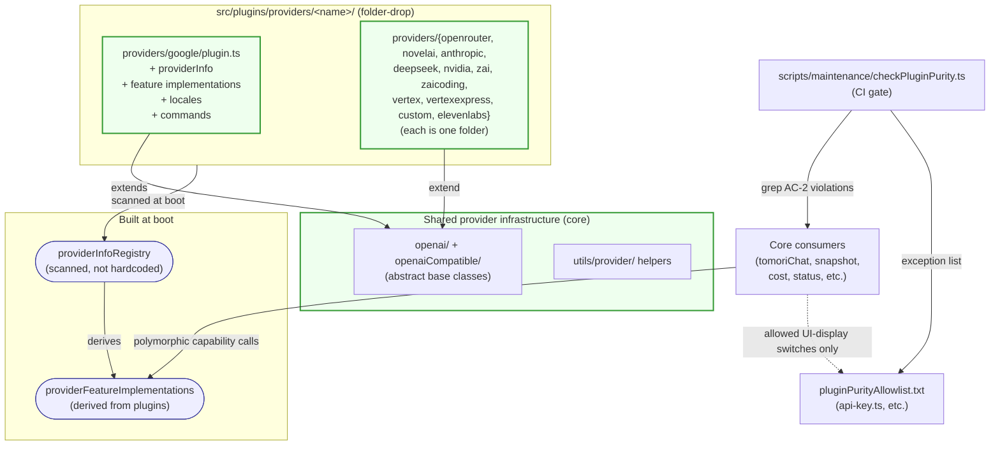

**What changed:**
- Each provider folder declares its own `providerInfo` and feature implementations — no central map to edit
- `ProviderFeatureImplementation` becomes a derived type, not a hand-written union
- The 79 name-switches are replaced by polymorphic capability dispatch (e.g., `provider.imageGeneration?.generate(...)`)
- `commands/help/api-key.ts` switches survive only on the allowlist, with a documented justification (UI copy, not orchestration)
- A CI script (`checkPluginPurity.ts`) fails the build if a new name-switch sneaks into core paths

---

## 3. Locale system

### Before

Two flat monolith files, 412KB and 515KB respectively. Every key — including provider-specific, ElevenLabs-specific, Matrix-specific — lives in the same tree. Editing them is a merge-conflict generator.

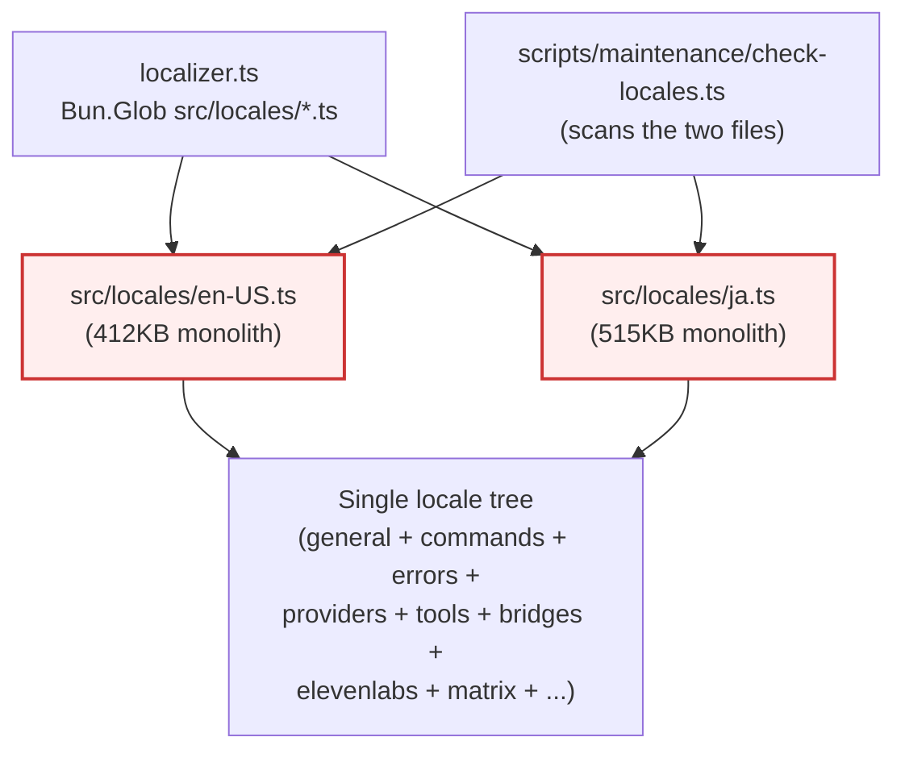

### After

Locales fragment by category at the global level (`src/locales/en-US/general.ts`, `commands.ts`, `errors.ts`, etc.) and plugins ship their own slices (`src/plugins/<name>/locales/{en-US,ja}.ts`). The localizer merges everything into one tree at boot.

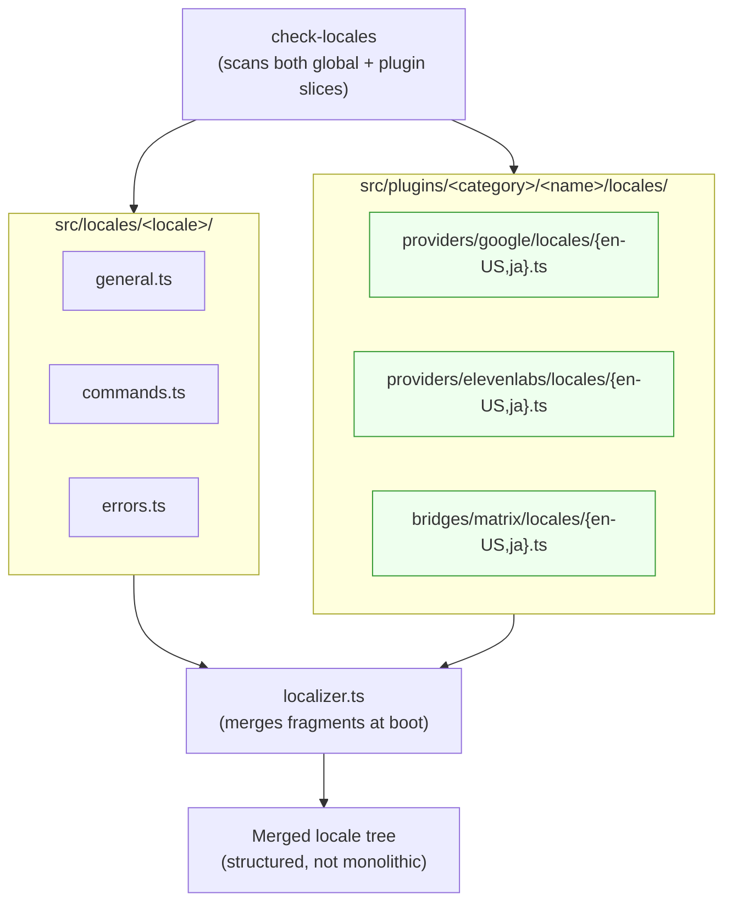

**What changed:**
- Deleting a plugin folder removes its locale keys — no orphaned entries in the global file
- Provider/tool/bridge keys live with their owner; merge conflicts now require *two* contributors editing the *same* plugin's locale (rare) instead of two contributors editing the same global file (constant)
- `check-locales.ts` is updated to discover plugin slices automatically (per Phase 1 #1 subtask)

---

## 4. Database access & schema ownership

### Before

Two god files (`dbRead.ts` 134KB / 73 exports, `dbWrite.ts` 105KB / 42 exports) plus separate `dataExport.ts` (30KB) and `dataImportV2.ts` (29KB). Every consumer imports raw SQL functions. Cache invalidation is scattered across call sites — easy to forget. The `tomori_configs` table is a god table containing config, runtime state, and ID references for many features mixed together.

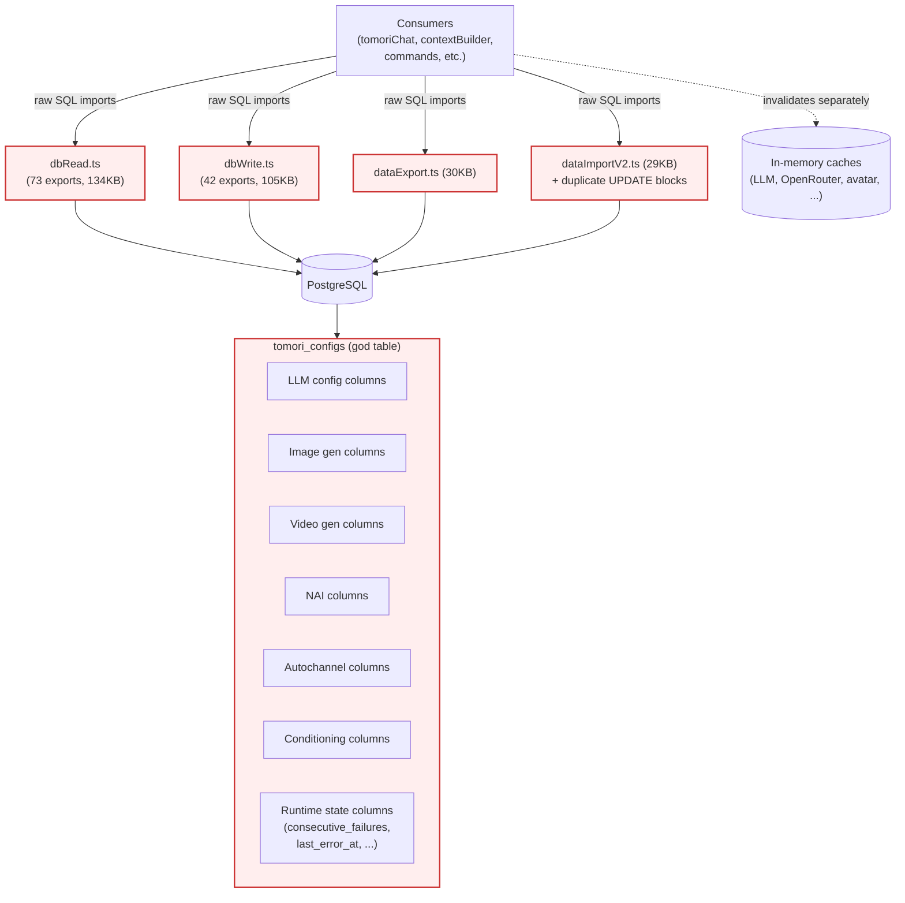

**What's wrong:**
- 115+ raw SQL exports — every consumer can construct any query, including unsafe ones
- Cache invalidation is the consumer's responsibility, not the data layer's — easy to forget after a write (CLAUDE.md mandates invalidation in the same code path)
- `tomori_configs` mixes static config with runtime state, so exporting config also exports stale failure counters (or has to manually exclude them)
- Plugins (when added) would naturally extend `tomori_configs` further, accelerating the rot

### After

Domain repositories own their tables and their cache invalidation. Plugins own their schema migrations. State is separated from configuration.

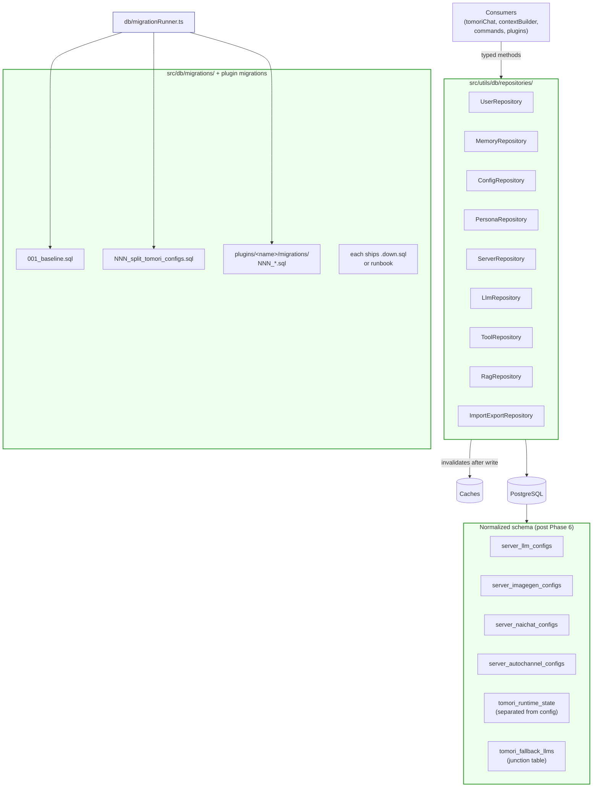

**What changed:**
- Consumers no longer write SQL — they call typed repository methods
- Cache invalidation lives *inside* the repository write methods, where it cannot be skipped
- `tomori_configs` is split by domain; runtime state moves out
- Plugins own their schema; the migration runner discovers `<plugin>/migrations/NNN_*.sql` and applies in order
- Every migration ships with a rollback artifact (`.down.sql` or runbook), enforced by CI

---

## 5. Bridges & audio (ElevenLabs / Matrix)

### Before

ElevenLabs has 6 bespoke files in `src/utils/audio/` plus event handlers (`src/events/elevenLabs*.ts`) plus its own commands plus locale entries scattered across `en-US.ts`/`ja.ts`. Matrix is a 59KB monolith (`src/utils/matrix/matrixManager.ts`) plus an event relay (`src/events/messageCreate/matrixRelay.ts`). Neither uses the generic `customEndpointService` plugin pattern.

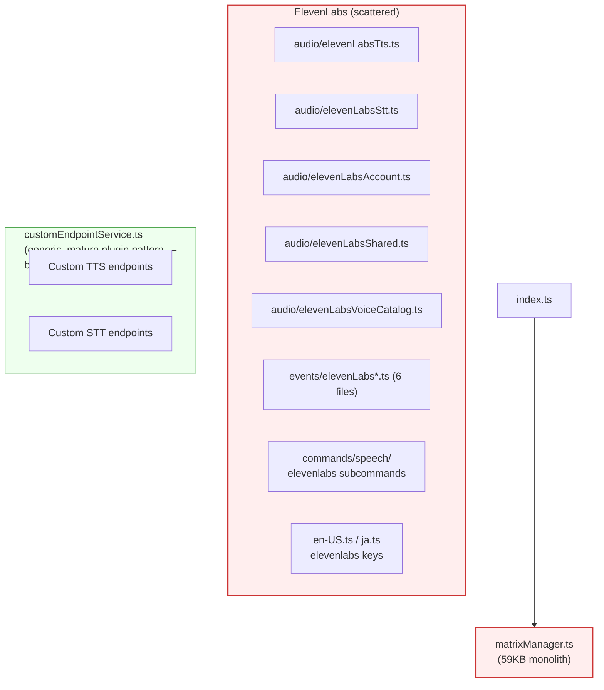

### After

ElevenLabs and Matrix become first-party plugins under `src/plugins/`. Each is a single self-contained folder.

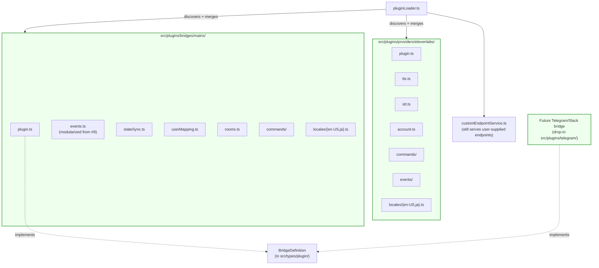

**What changed:**
- Deleting `src/plugins/providers/elevenlabs/` cleanly disables ElevenLabs without touching anything else
- Deleting `src/plugins/bridges/matrix/` cleanly disables the Matrix bridge
- A new bridge (Telegram, Slack) is one folder under `src/plugins/bridges/`, implementing `BridgeDefinition`
- `customEndpointService.ts` survives to handle truly user-supplied (not first-party) endpoints

---

## 6. The Plugin contract (the integration point)

This is the new piece that makes folder-drop discovery work. Each plugin folder exports a single `Plugin` object; the loader merges its contributions into the existing registries.

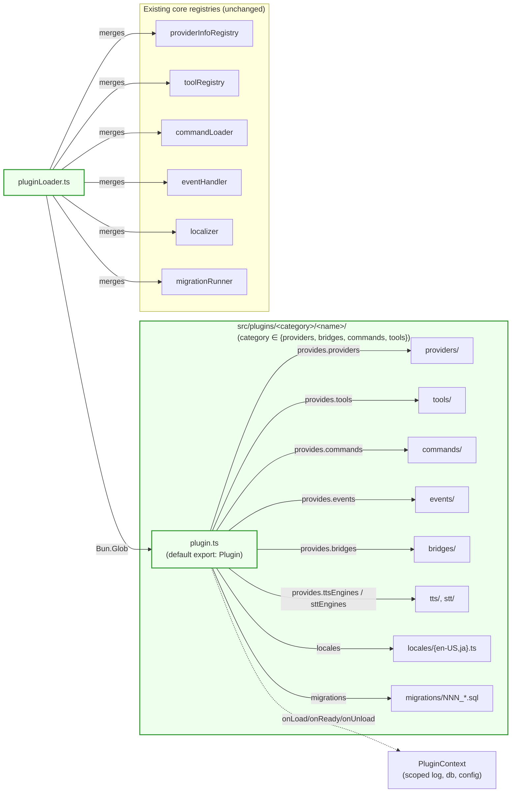

**Key property:** the loader does not replace the existing registries — it *contributes to them*. This is what makes the migration safe: the same registry consumers continue to work, whether the entries came from `src/commands/`, `src/tools/`, or `src/plugins/<name>/`.

---

## 7. Net change summary

| Dimension | Before | After |
|---|---|---|
| `index.ts` size | 476 lines, monolith | Thin orchestrator + `src/init/*` modules |
| `process.env` mutations in code | 20+ writes during boot | Replaced by typed `AppConfig` |
| `providerInfoRegistry.ts` shape | 11 hardcoded imports + hand-written type union + central feature map | Auto-discovered from `src/plugins/*/`; type union derived |
| Provider-name string switches in core | 79 across 17 files | 0 in core; UI-display exceptions on allowlist |
| Locale files | 2 monoliths (412KB + 515KB) | Fragmented globally + plugin-owned slices |
| DB SQL exports | 115+ (`dbRead` + `dbWrite`) | Domain repositories with typed methods |
| Cache invalidation responsibility | Caller's job (CLAUDE.md mandate) | Repository's job (encapsulated) |
| `tomori_configs` shape | God table mixing config + runtime state | Split by domain + state separated |
| Schema migrations | None — static `.sql` files | Sequential migration runner with rollback discipline |
| Adding a new provider requires touching | `providerInfoRegistry.ts` + 17+ consumer files | One folder under `src/plugins/providers/` |
| Adding a new bridge requires | Bespoke wiring (Matrix template) | One folder under `src/plugins/bridges/` implementing `BridgeDefinition` |
| ElevenLabs / Matrix locations | 6 files in `audio/` + 6 events + scattered locales / 59KB monolith in `utils/matrix/` | `src/plugins/providers/elevenlabs/` / `src/plugins/bridges/matrix/` (one folder each) |
| `src/plugins/` top-level layout | n/a | 4 categories: `providers/`, `bridges/`, `commands/`, `tools/` — single canonical home for every extension point |

---

## 8. Contributor difficulty: before vs. after

How hard is it to add a given type of feature right now, and where does it land after both plans are done? This table is the contributor-experience view — a complement to the technical diff in §7.

**Key:** 🔴 High effort (multiple unrelated files, god-file edits, or fragile manual wiring) · 🟡 Medium (contained but tedious) · 🟢 Low (drop one file or folder, run quality gates, done)

| What you want to add | Files touched today | Files touched after | Difficulty |
|---|---|---|---|
| **New LLM provider** | `providerInfoRegistry.ts` (3 hardcoded sections) + up to 17 consumer files with new name-switches + locale monolith | One folder `src/plugins/providers/<name>/` with `plugin.ts`, locale slice, optional migration | 🔴 → 🟢 |
| **New slash command** | One file in `src/commands/<category>/` (auto-discovered) + locale monolith for any strings | One folder `src/plugins/commands/<category>/<name>/` with `plugin.ts` (+ optional `locales/` slice) | 🟢 → 🟢 |
| **New built-in tool** | One file in `src/tools/functionCalls/` (auto-discovered) + locale monolith | One folder `src/plugins/tools/functionCalls/<name>/` with `plugin.ts`, OR colocated inside a provider plugin's `tools/` if provider-tied | 🟢 → 🟢 |
| **New REST API / MCP tool** | One folder in `src/tools/restAPIs/` or `mcpServers/` + locale monolith | One folder under `src/plugins/tools/{functionCalls,mcpServers}/<name>/` | 🟢 → 🟢 |
| **New Discord event handler** | One file in `src/events/<eventName>/` (auto-discovered) | Same (event handlers stay in `src/events/`) — or declare additional handlers via `Plugin.events` from inside any plugin folder | 🟢 → 🟢 |
| **New bridge (Telegram, Slack)** | Copy-paste Matrix monolith pattern (59KB), wire manually in `index.ts`, scatter locale keys, add event relay | One folder `src/plugins/bridges/<name>/` implementing `BridgeDefinition` | 🔴 → 🟢 |
| **New TTS / STT engine** | Wire bespoke files like ElevenLabs (6+ files across `audio/` and `events/`), unless it fits the generic custom-endpoint pattern | One folder `src/plugins/providers/<name>/` declaring `provides.ttsEngines` / `provides.sttEngines` | 🟡 → 🟢 |
| **Any new locale strings** | Edit one of two 400–500KB monolith files — nearly guaranteed merge conflict if two PRs are open | Edit a plugin-owned or category-scoped slice; no conflict unless two PRs touch the *same* plugin | 🟡 → 🟢 |
| **New feature with its own DB table** | Add raw SQL to `schema.sql`, export query functions from `dbRead.ts` + `dbWrite.ts` (both 100KB+ god files), manually call cache invalidation at every write site | Plugin-owned `migrations/NNN_*.sql` + scoped repository class; invalidation encapsulated inside the repository | 🟡 → 🟢 |
| **Behavioral modifier to an existing pipeline** *(e.g. memory filters, context hooks — see note below)* | Edit `tomoriChat.ts` (7,000+ lines) or `contextBuilder.ts` (800+ lines) directly + locale monolith + raw DB SQL | Edit the relevant modularized module (post-refactor #10/#12 split) — smaller surface, but still core code | 🔴 → 🟡 |

### On behavioral modifiers

The last row covers a different category of feature — not adding a *new extension point*, but changing *how an existing pipeline behaves*. Examples:

- Filtering which memories get injected into context (e.g., by tag, recency, or relevance)
- Preprocessing a message before it reaches the LLM
- Postprocessing a response before it's sent
- Injecting additional context after a tool call completes

The plugin architecture plan solves extension-point additions cleanly: drop a folder, register a `Plugin` object, done. But the `Plugin` contract has no hook for these — because the pipeline has no explicit splice points yet. Adding a behavioral modifier still requires editing core orchestration code (`contextBuilder.ts` or `tomoriChat.ts`).

**Why the refactor plan is what actually helps here:** right now these pipeline stages are buried inside 7,000-line god files with no clear seams. Once `tomoriChat.ts` is deconstructed (refactor #12) and `contextBuilder.ts` is modularized (#10), discrete steps like `buildMemoryContext()` become explicit function boundaries — and those boundaries are natural hook points. The modularization reveals where to splice, rather than requiring you to spec it in advance.

**What would make it 🟢:** named hook points on the `Plugin` contract (e.g., `Plugin.hooks?.onBeforeMemoryInject`), added on-demand as real use cases emerge — not speculatively. Hook points should only be cut into the pipeline when a concrete feature motivates them. For now, contributors adding behavioral modifiers should expect to touch core, and the refactor plan is what makes that surface area small and reviewable.

### Identifying hook-point candidates from real-world PRs

The right time to add a hook to `PluginHooks` is **after** a feature has shown that the same pipeline seam needs to be touched twice. A heuristic for proposing a new hook:

1. A PR lands that touches a modularized core file (`src/utils/chat/orchestrator.ts`, `src/utils/text/context/*.ts`, etc.) to *filter* or *transform* pipeline state — not to add a wholly new step, just to alter what the existing step does.
2. The next contributor who wants a similar filter/transform faces the same core edit.
3. At that point, propose `Plugin.hooks?.onBeforeXxx` covering the seam. Both features migrate to plugin folders; subsequent ones land as plugins from day one.

**Plausible future hooks** (do not pre-add — wait for a motivating PR):
- `onBeforeToolDispatch(ctx)` — modify the tool list passed to the provider for this turn
- `onBeforeContextBuild(ctx)` — modify or veto the assembled context
- `onAfterToolResult(ctx)` — inspect or rewrite a tool's output before it re-enters the LLM stream
- `onBeforePersonaTrigger(ctx)` — alter trigger-detection input (mention rules, persona keywords)

### A separate gap — *contributing to* core diagnostic commands

A plugin that wants its state visible in `/snapshot` or `/status` (today: every feature edits those commands directly) is a different problem from behavioral modifiers. The cleanest answer is a contract field: `Plugin.provides.diagnosticPanels?: DiagnosticPanelDefinition[]`, with `/snapshot` and `/status` rendering the merged registry. This is also deferred — add when the second feature wants its own diagnostic section.

---

## 9. What this document is not

- **Not a plan.** The execution sequence is in `PLUGIN-ARCH_REFACTOR-PREREQUISITES.md` and `PLUGIN-ARCH_TASK-LIST.md`. Diagrams here describe the destination, not the path.
- **Not exhaustive.** Smaller subsystems (status command split, contextBuilder modularization, stream adapter unification) have their own diagrams in their respective phase docs if needed. This file covers the architectural *spine*.
- **Not immutable.** When a plan phase ships and the diagrams here drift from reality, update them in the same PR. Stale diagrams are worse than no diagrams.
