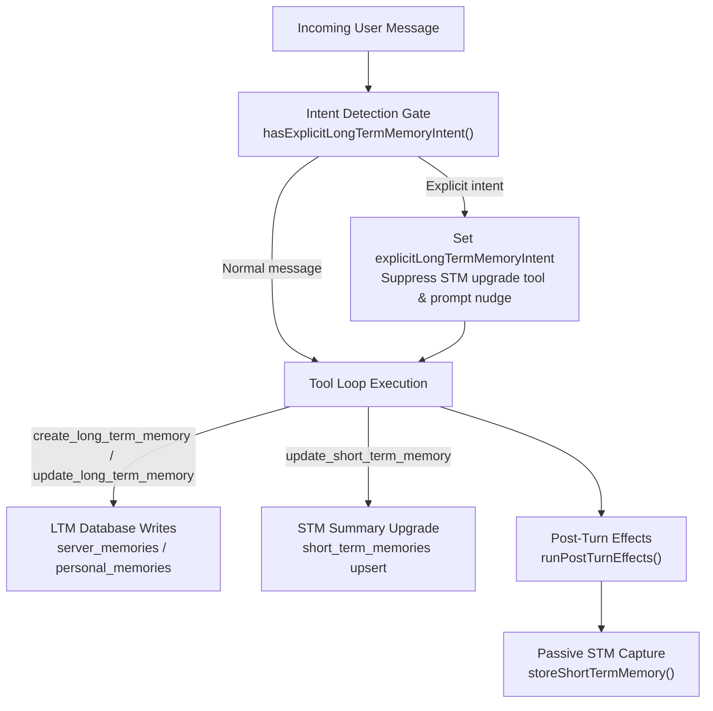

The memory pipeline manages state writes around a chat turn. It records recent conversation turns in working memory, handles model-authored summary upgrades, and persists long-term facts to the database through tool calls.

The pipeline splits into two distinct paths:

- **Short-term memory (STM):** captures conversation turns into an in-process cache after each generation turn, with optional model-authored summary or category upgrades via the `update_short_term_memory` tool.
- **Long-term memory (LTM):** executes database writes when the model invokes `create_long_term_memory` or `update_long_term_memory` during the tool loop.

An intent detection gate checks whether the user asked to remember information permanently, steering the model toward LTM tools instead of STM upgrades.

## Intent detection gate

The gate function `hasExplicitLongTermMemoryIntent()` in `src/utils/memory/explicitLongTermMemoryIntent.ts` runs during turn context initialization in `src/utils/chat/contextPipelineIntent.ts`. It normalizes the user message using NFKC formatting and checks it against localized phrases defined in `EXPLICIT_MEMORY_PACK_KEY` (`src/utils/text/localeIntentPacks.ts`).

When explicit intent matches:

1. `streamingContext.explicitLongTermMemoryIntent` is set to `true`.
2. `UpdateShortTermMemoryTool.isAvailableForContext()` returns `false`, removing the STM upgrade tool from the offered tool definitions.
3. The prompt nudge built in `buildShortTermMemoryContext()` (`src/utils/text/context/memories.ts`) is omitted.
4. If invoked directly, `UpdateShortTermMemoryTool.execute()` rejects execution.

## Sub-pipelines

| Sub-pipeline | Stages | Scope |
|---|---|---|
| [STM](/architecture/pipelines/memory/stm/) | [01: Passive Capture](/architecture/pipelines/memory/stm/01-passive-capture/) [02: Summary Upgrade](/architecture/pipelines/memory/stm/02-summary-upgrade/) | Working memory: in-process cache turns and durable `short_term_memories` rows |
| [LTM](/architecture/pipelines/memory/ltm/) | [01: Memory Creation](/architecture/pipelines/memory/ltm/01-ltm-create/) [02: Memory Update & Delete](/architecture/pipelines/memory/ltm/02-ltm-update-delete/) | Permanent storage: database writes for server and personal memory tables |

## Cross-references

- **Post-turn write caller:** [Run Generation Turn: Post-Turn Effects](/architecture/pipelines/chat/06-per-turn/04-post-turn-effects/) triggers passive STM capture after generation completes.
- **Tool execution caller:** [Execute Tool Call](/architecture/pipelines/tool-loop/02-execute-tool-call/) runs tool-initiated memory updates.
- **STM reader:** [Short-Term Memory Context](/architecture/pipelines/context-build/02-native-assembly/07-short-term-memory/) formats working memory entries for prompt assembly.
- **Server memory reader:** [Server Memories Context](/architecture/pipelines/context-build/02-native-assembly/03-server-memories/) formats server-wide memories for prompt assembly.
- **Personal memory reader:** [Participants Context](/architecture/pipelines/context-build/02-native-assembly/06-participants/) hydrates personal memories for each participant.

## Memory taxonomy

| Type | Storage | TTL | Write path | Context consumer |
|---|---|---|---|---|
| STM crude turns | In-process cache (`Map`) | Entry: 12 hours, or 24 when summary text exists | Passive turn capture (`storeShortTermMemory`) | STM context assembly |
| STM summary / categories | In-process cache and `short_term_memories` table | Cache: 24 hours with summary text, otherwise 12 hours; database: separate retention | Tool call (`update_short_term_memory`) | STM context assembly (takes priority over crude turns) |
| LTM server memory | `server_memories` table | Permanent | Tool call (`create_long_term_memory`) | Server memories context assembly |
| LTM personal memory | `personal_memories` table | Permanent | Tool call (`create_long_term_memory`) | Participants context assembly |

## Shared constraints and lifecycle

### Feature flags

- **LTM tools:** both `create_long_term_memory` and `update_long_term_memory` require `self_teaching_enabled = true` in `TomoriState.config`. When disabled, tool execution aborts without writing to the database.
- **STM automation:** `short_term_memory_enabled` disables the update tool and cadence nudge. Existing memory content still renders, allowing manually curated summaries to remain useful. NovelAI does not receive the update tool.

### Privacy guards

- **Triggerer privacy:** if the triggering user has `PrivacyLevel.FULL`, passive STM capture aborts immediately.
- **Target user privacy:** if a target user has `PrivacyLevel.PARTIAL` or `PrivacyLevel.FULL`, personal memory creation and updates return a privacy restriction error.
- **Persona lineage:** LTM records are partitioned by `persona_lineage_id`. Creation is blocked if `persona_lineage_id === 0` because zero is reserved for global memories.

### Cache invalidation ownership

- **STM writes:** live cache entries update in place before database persistence, so no secondary cache invalidation is required.
- **Server LTM writes:** Both tools invalidate Tomori state after database success. Server creation currently awaits its Discord notification first, so a notification failure can leave cached state stale. Update and deletion invalidate before notification.
- **Personal LTM writes:** both tools call `invalidateUserCache(userId)` after successful database writes, so subsequent prompt assemblies fetch fresh records.
